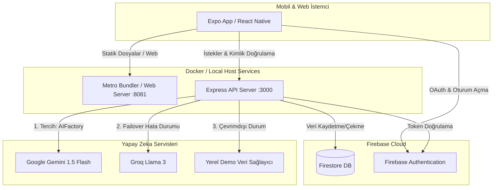

# 🌙 Rüya Yorumlayıcı (Dream Interpreter)

<p align="center">
  
</p>

<h3 align="center">"Bilinçaltınızın Haritasını Çıkarın."</h3>

<p align="center">
  Yapay Zeka destekli, Jungiyen ve Freudyen psikolojik derinliği olan, modern ve güvenli bir rüya takip ve analiz platformu.
</p>

<p align="center">
  
  
  
  
  
  
  <br>
  
  
</p>

---

## 📋 İçindekiler

- [📱 Uygulama Hakkında](#-uygulama-hakkında)
- [🏗️ Sistem Mimarisi](#%EF%B8%8F-sistem-mimarisi)
- [✨ Gelişmiş Yapay Zeka Özellikleri (AI Core 3.0)](#-gelişmiş-yapay-zeka-özellikleri-ai-core-30)
- [🎨 Ekranlar ve Özellikler](#-ekranlar-ve-özellikler)
- [🛠️ Teknolojiler](#%EF%B8%8F-teknolojiler)
- [📦 Kurulum ve Çalıştırma](#-kurulum-ve-çalıştırma)
  - [Seçenek A: Docker ile Çalıştırma (Önerilen)](#seçenek-a-docker-ile-çalıştırma-önerilen)
  - [Seçenek B: Yerel Host Üzerinde Çalıştırma](#seçenek-b-yerel-host-üzerinde-çalıştırma)
- [⚙️ Çevre Değişkenleri (.env)](#%EF%B8%8F-çevre-değişkenleri-env)
- [📁 Proje Klasör Yapısı](#-proje-klasör-yapısı)
- [🔒 Güvenlik ve Gizlilik](#-güvenlik-ve-gizlilik)

---

## 📱 Uygulama Hakkında

**Rüya Yorumlayıcı**, sıradan bir "rüya tabirleri" sözlüğü değildir. **Carl Gustav Jung**'un kolektif bilinçdışı/arketipler teorisini ve **Sigmund Freud**'un rüya analizi prensiplerini modern Yapay Zeka (LLM) teknolojileriyle harmanlar. 

Sistemimiz rüyalarınızı basitçe "iyi" ya da "kötü" şeklinde etiketlemek yerine; rüyadaki sembolleri, baskın duygusal tonları ve zihinsel enerji seviyelerini analiz ederek kişiye özel psikolojik içgörüler ve günlük hayatında uygulayabileceği farkındalık tavsiyeleri sunar.

---

## 🏗️ Sistem Mimarisi

Uygulamanın veri akışı ve servisler arası iletişimi aşağıdaki gibidir:



---

## ✨ Gelişmiş Yapay Zeka Özellikleri (AI Core 3.0)

Uygulamanın merkezinde, standart yapay zeka çağrılarının çok ötesine geçen **4 Katmanlı Hibrit Bir Analiz Motoru** yer alır:

### 1. 🕸️ Bağlamsal Hafıza (Contextual Awareness)
Yapay Zeka, rüyalarınızı birbirini izlemeyen tekil olaylar olarak ele almaz. Önceki rüya geçmişinizi tarayarak zaman içindeki psikolojik örüntüleri yakalar.
*   **Çalışma Biçimi:** Yeni bir rüya analiz edilmeden önce son 5 rüya veritabanından çekilip özetlenir ve prompt bağlamına eklenir.
*   **Örnek:** *"Geçen haftaki rüyalarında hissettiğin sıkışmışlık hissi, bu rüyanda yerini uçma sembolüyle özgürlüğe bırakmış..."* şeklinde kronolojik analiz yapabilir.

### 2. 🎭 Adaptif Kişilik (Adaptive Persona)
Her kullanıcının rüya dili ve duymak istediği rehberlik tarzı farklıdır. Profil ayarlarınızdan seçebileceğiniz 3 farklı arketip bulunur:
*   🔮 **Mistik (The Oracle):** Spiritüel, ezoterik ve enerji odaklı bir dil kullanır.
*   🎓 **Analitik (Dr. Aether):** Jungiyen psikoloji terimlerine bağlı, rasyonel ve bilimsel analiz sunar.
*   🌿 **Rehber (The Guide):** Çözüm odaklı, sıcak, günlük hayata uygulanabilir pratik tavsiyeler verir.

### 3. 📚 Bilgi Destekli Üretim (RAG - Retrieval-Augmented Generation)
Halüsinasyonu sıfırlamak ve kültürel doğruluğu korumak için yerleşik sembol sözlüğü kullanılır:
*   **Çalışma Biçimi:** Rüya metnindeki anahtar kelimeler (yılan, su, uçmak vb.) taranır, yerel sembol veritabanından anlamları eşleştirilir ve yapay zekaya referans kaynak olarak beslenir.
*   **Sonuç:** Analizler tamamen literatüre ve kültürel sembollere bağlı kalarak tutarlı sonuçlar üretir.

### 4. 🔗 Zincirleme Düşünce (CoT - Chain of Thought)
Yapay Zeka tek aşamada düz bir metin üretmez; arka planda 3 aşamalı bir mantık süzgecinden geçer:
1.  **Dedektif Aşaması:** Rüyadaki tüm somut nesneleri, renkleri ve eylemleri belirler.
2.  **Analist Aşaması:** Nesnelerin psikolojik arketiplerle (Gölge, Anima, Persona) ilişkisini kurar.
3.  **Sentez Aşaması:** Bulguları birleştirip kullanıcıya akıcı ve derinlikli bir yorum metni hazırlar.

---

## 🎨 Ekranlar ve Özellikler

*   🏠 **Ana Ekran (Home):** Hızlı rüya girişi, saate göre değişen dinamik gradyan arka planlar ve günlük rüya ilham sözleri.
*   ⚡ **Analiz Ekranı (Result):** AI Analiz raporu, 0-100 arası enerji puanı, tespit edilen semboller kartı ve günlük hayatta uygulanabilir tek cümlelik farkındalık (Actionable Insight).
*   📜 **Geçmiş Ekranı (History):** Favorileme, rüya arama ve pozitif/negatif/nötr rüya filtreleri.
*   📊 **İstatistikler (Stats):** Son 30 günün duygu analizi grafiği, en çok görülen sembol frekansları ve zihinsel enerji değişim şeması.
*   📅 **Takvim (Calendar):** Rüyaların sıklığını gösteren ısıl harita (Heatmap) ve aylık rüya takipleri.
*   👤 **Profil (Profile):** Kullanıcı rozet seviyeleri (Acemi Kaşif'ten Rüya Üstadı'na), bulut yedekleme seçenekleri ve tek tuşla hesap/veri silme (KVKK Uyumlu).

---

## 🛠️ Teknolojiler

*   **Frontend:** Expo SDK 54 (React Native), TypeScript, React Navigation, React Native Paper (Material UI), Lottie Animations.
*   **Backend:** Node.js, Express, TypeScript, Nodemon, ts-node.
*   **Veritabanı ve Auth:** Firebase Firestore, Firebase Admin SDK.
*   **Docker:** Docker Compose, multi-stage lightweight Debian-slim build.
*   **Yapay Zeka API'leri:** Google Gemini API (1.5 Flash), Groq API (Llama 3), OpenAI API (Opsiyonel).

---

## 📦 Kurulum ve Çalıştırma

Geliştirme ortamını ayağa kaldırmak için iki seçeneğiniz vardır:

### Seçenek A: Docker ile Çalıştırma (Önerilen)

Docker kurulumu, Windows/macOS/Linux ortamlarında hiçbir paket yükleme karmaşası olmadan, izole bir ortamda ve **kod değişikliklerinizde anlık güncelleme (hot-reloading)** desteği ile çalışır.

1.  **Docker Desktop** programının açık olduğundan emin olun.
2.  Ana dizinde terminali açın ve projeyi ayağa kaldırın:
    ```bash
    docker compose up
    ```
3.  Docker, servisleri şu portlar üzerinden başlatacaktır:
    *   **Backend:** `http://localhost:3000`
    *   **Frontend (Web):** `http://localhost:8081`

> [!TIP]
> **Expo Go ile Fiziksel Telefondan Bağlanma**
>
> Metro bundler Docker içinde çalıştığı için, fiziksel telefonunuzun Expo Go uygulamasıyla QR kodu tarayabilmesi adına yerel IP adresinizi tanımlamanız gerekir:
> 1. Terminalinizden yerel LAN IP'nizi bulun (örn: `192.168.1.50`).
> 2. `docker-compose.yml` dosyasını açıp `REACT_NATIVE_PACKAGER_HOSTNAME` satırının başındaki `#` işaretini kaldırın ve kendi IP'nizi yazın:
>    ```yaml
>    - REACT_NATIVE_PACKAGER_HOSTNAME=192.168.1.50
>    ```
> 3. Frontend container'ını yeniden başlatın. Artık Expo Go uygulamasından QR kod ile bağlanabilirsiniz.

---

### Seçenek B: Yerel Host Üzerinde Çalıştırma

Eğer Docker kullanmak istemiyorsanız, yerel Node.js ortamınızda aşağıdaki adımları takip edebilirsiniz:

#### 1. Backend Kurulumu:
```bash
cd backend
npm install
# .env.example dosyasını .env olarak kopyalayıp API anahtarlarınızı girin
npm run dev
```

#### 2. Frontend Kurulumu:
```bash
cd ../frontend
npm install
# .env.example dosyasını .env olarak kopyalayıp Firebase bilgilerinizi girin
npx expo start
```
*   Tüm platformlar için Metro arayüzünden `w` tuşuna basarak **Web** sürümünü açabilir veya telefonunuzun kamerasıyla QR kodu taratarak **Expo Go** üzerinden mobil cihazınızda çalıştırabilirsiniz.

---

## ⚙️ Çevre Değişkenleri (.env)

Projeyi çalıştırmadan önce `backend` ve `frontend` klasörleri içinde yer alan `.env` dosyalarını yapılandırmanız gerekir.

### Backend `.env` Değişkenleri (`backend/.env`)
| Değişken | Açıklama | Gerekli mi? |
| :--- | :--- | :--- |
| `PORT` | Backend sunucusunun çalışacağı port (Varsayılan: `3000`) | Evet |
| `GEMINI_API_KEY` | Google AI Studio'dan alacağınız ücretsiz Gemini API anahtarı | Evet |
| `GROQ_API_KEY` | Groq platformundan alacağınız yedek failover Llama 3 API anahtarı | Evet |
| `OPENAI_API_KEY` | OpenAI API Anahtarı (Opsiyonel) | Hayır |
| `FIREBASE_PROJECT_ID` | Firebase Proje Kimliğiniz | Evet |
| `FIREBASE_CLIENT_EMAIL` | Firebase Service Account E-postası | Evet |
| `FIREBASE_PRIVATE_KEY` | Firebase Service Account Özel Anahtarı | Evet |

> [!NOTE]
> Backend servisinin Firebase'e bağlanabilmesi için Firebase Console'dan ürettiğiniz `serviceAccount.json` dosyasını `backend/` klasörünün içine yerleştirmeniz veya `.env` içerisindeki `FIREBASE_PRIVATE_KEY` alanını doldurmanız gerekmektedir.

### Frontend `.env` Değişkenleri (`frontend/.env`)
| Değişken | Açıklama | Gerekli mi? |
| :--- | :--- | :--- |
| `API_URL` | Backend servisinin adresi (Geliştirme için: `http://localhost:3000`) | Evet |
| `FIREBASE_API_KEY` | Firebase Web API Anahtarı | Evet |
| `FIREBASE_AUTH_DOMAIN` | Firebase Auth Domain | Evet |
| `FIREBASE_PROJECT_ID` | Firebase Proje Kimliği | Evet |
| `FIREBASE_STORAGE_BUCKET` | Firebase Storage Bucket | Evet |
| `FIREBASE_MESSAGING_SENDER_ID` | Firebase Bildirim Gönderici No | Evet |
| `FIREBASE_APP_ID` | Firebase Uygulama Kimliği | Evet |

---

## 📁 Proje Klasör Yapısı

```text
ruyayorumlayici/
├── docker-compose.yml       # Docker orchestrator dosyası
├── .dockerignore            # Root Docker ignore kuralları
├── README.md                # Proje tanıtım belgesi
│
├── backend/
│   ├── src/
│   │   ├── config/          # Firebase & AI konfigürasyonları
│   │   ├── services/        # AI Yorumlama & RAG motoru
│   │   └── server.ts        # Express API giriş noktası
│   ├── data/
│   │   └── dream_symbols.json # RAG için lokal sembol sözlüğü
│   ├── Dockerfile           # Backend Docker imaj talimatları
│   ├── .dockerignore        # Backend Docker ignore dosyası
│   ├── package.json
│   └── tsconfig.json
│
└── frontend/
    ├── src/
    │   ├── components/      # UI bileşenleri (Kartlar, Isı Haritası vb.)
    │   ├── screens/         # Uygulama ekranları (Home, History, Stats)
    │   └── context/         # Auth & Tema Context State Management
    ├── assets/              # Lottie animasyonları ve görseller
    ├── App.tsx              # Uygulama giriş noktası
    ├── app.json             # Expo proje ayarları
    ├── Dockerfile           # Frontend Docker imaj talimatları
    ├── .dockerignore        # Frontend Docker ignore dosyası
    └── package.json
```

---

## 🔒 Güvenlik ve Gizlilik

Proje **KVKK ve GDPR** gizlilik ilkelerine tam uyumlu tasarlanmıştır:
1.  **Oturumsuz Kullanım:** Kullanıcılar hesap açmadan "Guest" olarak rüyalarını yerel hafızada analiz edebilirler.
2.  **Veri Şifreleme:** Firebase kuralları ile her kullanıcının yalnızca kendi rüyalarını görebilmesi/silebilmesi garanti altına alınmıştır.
3.  **Hesap Silme:** Profil ekranındaki "Hesabımı Sil" butonu, kullanıcının tüm rüya geçmişini ve profil verilerini Firebase Firestore'dan kalıcı olarak temizler.
